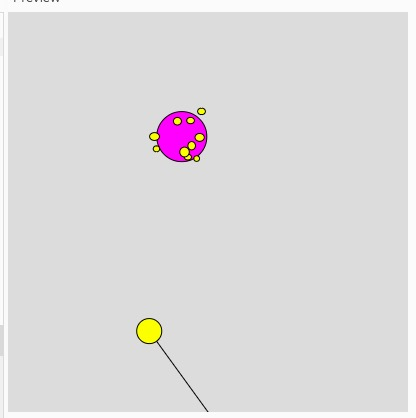

# DONT LET ME DOWN

This code is a “starter kit” for using [p5.js](https://p5js.org) with a sketch
written as a [JavaScript
module](https://developer.mozilla.org/en-US/docs/Web/JavaScript/Guide/Modules).

## Description

This is an interactive game of launching a ball and killing the virus. Under the general background of Covid-19, humans as a community make every effort to fight against the virus. By consistant trials, we are believed to win the game and therefore conquer the difficulty.

## Usage

Click the mouse to launch the ball.
Bounce the ball to hit the virus.
Win if you finally kill the virus.
Lose if you let the ball down.

## Authors

Tian Jin tj1059@nyu.edu
Yuyang Cai cy1503@nyu.edu

## Acknowledgements (to be finished)

// Acknowledge the source of code and assets, any help you got, and work that inspired the project.
