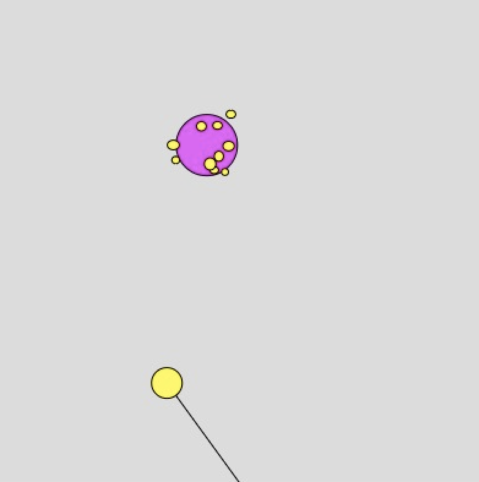

# DONT LET ME DOWN

## Description

This is an interactive game of launching a ball and killing the virus. Under the general background of Covid-19, humans as a community make every effort to fight against the virus. By consistant trials, we are believed to win the game and even conquer the current difficulties.

## Usage

Press the Space key to launch the ball.
Bounce the ball to hit the virus.
Win if you hit the virus 3 times out of 5.
Lose if you let the ball down.

## Authors

Jyoti tj1059@nyu.edu
Cara cy1503@nyu.edu

## Acknowledgements (To be finished)

// Acknowledge the source of code and assets, any help you got, and work that inspired the project.
